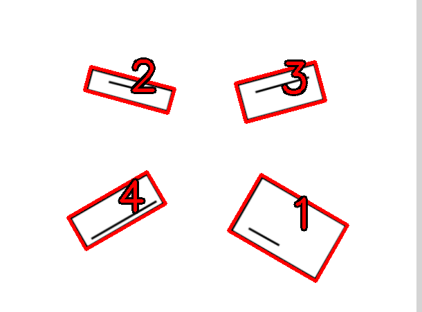

---

# Rectangle Numbering and Alignment Project

This project aims to detect rectangles in an image, rectify them to align them horizontally, and display them all in one frame. The project is implemented in Python using the OpenCV library.

## Setup

### Installation

1. Clone the GitHub repository:

```
git@github.com:mohansharma077/treeleaf_internship.git```

2. Navigate to the project directory:

```
cd treeleaf_internship
```

3. Install the required dependencies listed in the `requirements.txt` file:

```
pip install -r requirements.txt
```

## Usage

1. Place your input image in the project directory.

2. Run the `rectangle_alignment.py` script. This script loads the input image, detects rectangles, rectifies them to align them horizontally, and displays them all in one frame.

```
python rectangle_alignment.py
```

3. Press any key to close the output window.

## File Structure
- `rectangle_numbering.py`: The main Python script that performs rectangle numbering based on the line inside rectangle and display.
- `rectangle_alignment.py`: The main Python script that performs rectangle detection, rectification, and display.
- `requirements.txt`: A list of Python dependencies required to run the project.
- `Screenshot from 2024-02-22 21-22-06.png`: Sample input image used in the project.
- `README.md`: This README file providing an overview of the project.

## Sample Output





---


You can replace `"your-username"` with your actual GitHub username in the clone command. This README file provides clear instructions on how to install the project from a GitHub repository and how to use it.